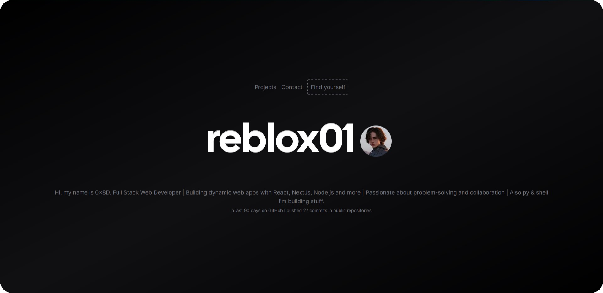

# Portfolio Developers



## Overview

**Portfolio Developers** is a web application that showcases GitHub users' portfolios by aggregating their repositories, profile information, and social media links. Users can search for their GitHub profile by username and view their curated portfolio, making it easier for developers to present their work and skills.

## Features

- **GitHub Integration**: Automatically fetches repositories, email, and social media links from GitHub profiles.
- **User Search**: Allows users to search for their profiles by GitHub username.
- **Dynamic Portfolios**: Displays user profiles with an overview of their repositories and relevant information.
- **Social Media Links**: Includes links to users' social media accounts.

## Getting Started

### Prerequisites

- [Node.js](https://nodejs.org/) (v14 or higher)
- [npm](https://www.npmjs.com/) or [yarn](https://yarnpkg.com/)

### Installation

1. Clone the repository:

   ```bash
   git clone https://github.com/reblox01/portfolio-developers.git
   cd portfolio-developers
   ```

2. Install dependencies:

   ```bash
   npm install
   # or
   yarn install
   ```

3. Set up environment variables:

   Create a `.env` file in the root directory and add the following:
   ```bash
   GITHUB_TOKEN=your_github_token
   ```

4. Start the development server:

   ```bash
   npm start
   # or
   yarn start
   ```

5. Open http://localhost:3000 in your browser.

## Usage

  - Visit the homepage and enter your GitHub username to find your profile.
  - Explore your repositories and profile information.
  - Share your portfolio link with others.

## Contributing

Contributions are welcome! Please follow these steps:

  1. Fork the repository.
  2. Create a new branch `git checkout -b feature/your-feature-name`
  3. Make your changes and commit them `git commit -m 'Add your feature'`
  4. Push to the branch `git push origin feature/your-feature-name`
  5. Create a pull request.

## License

This project is licensed under the MIT License. See the [LICENSE](LICENSE) file for details.

## Contact

For any questions or inquiries, please contact [0x8D](mailto:mirocairo15@gmail.com).

## Support

If you find this project useful and would like to support its development, consider buying me a coffee:

<a href="https://www.buymeacoffee.com/arosck1"></a>

## Acknowledgements

Thank you to everyone who has supported and contributed to this project. Your feedback and assistance are invaluable.
